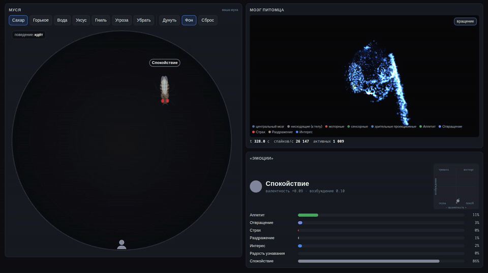
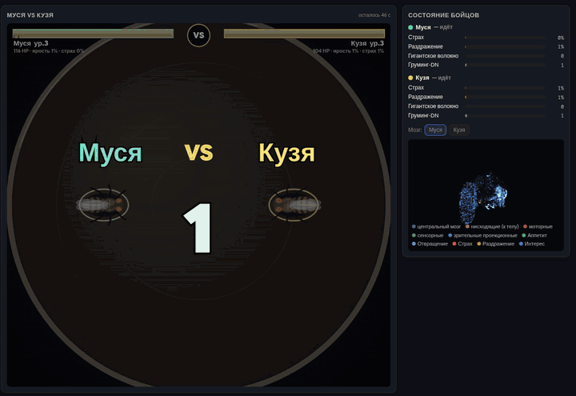
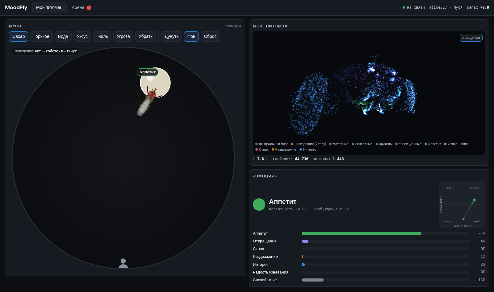
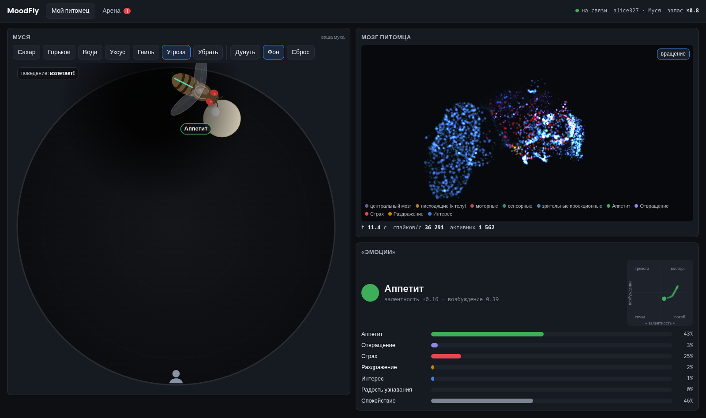
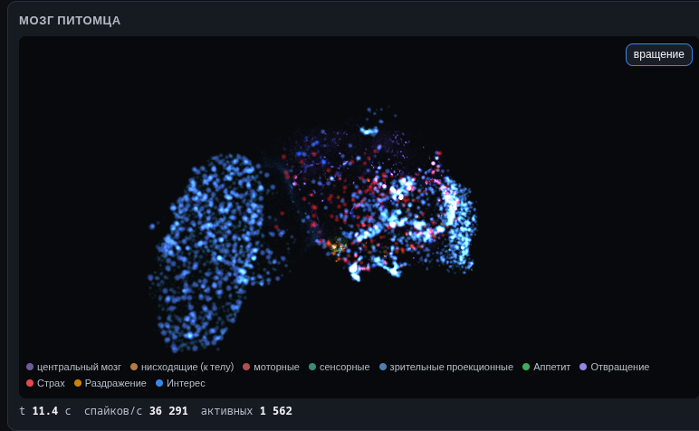
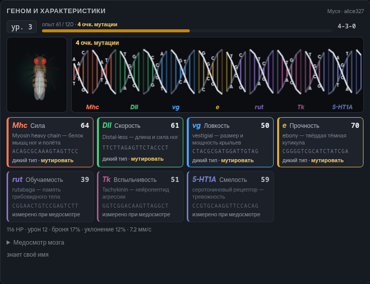
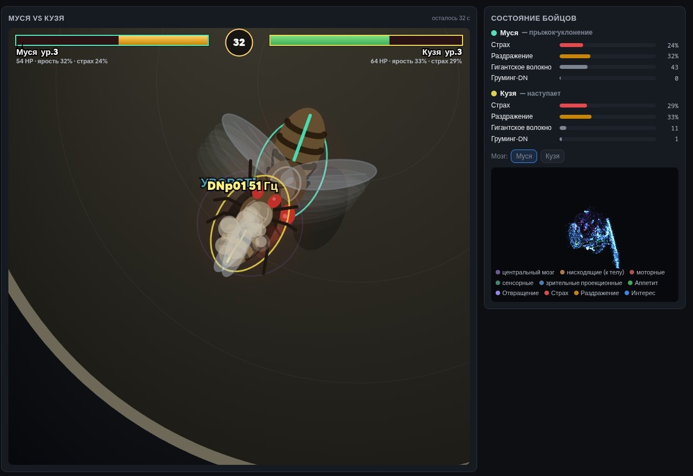
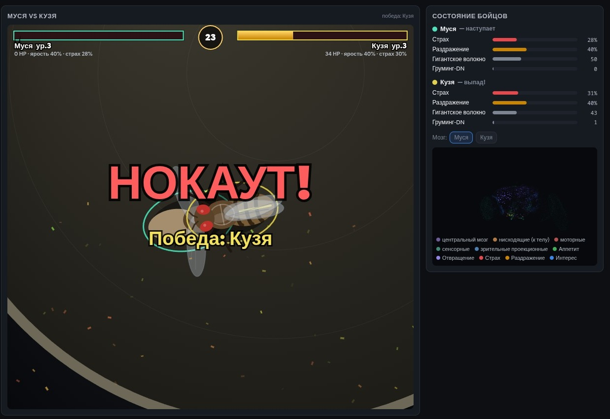

# MoodFly 🪰🧠

Тамагочи, только у питомца настоящий мозг.
В основе проекта лежит спайковая модель центрального мозга дрозофилы (Drosophila melanogaster), собранная по официальному коннектому FlyWire — полной карте связей между ~61 000 нейронов.

Муху можно обучать, откликаться на имя, прокачивать ей гены и отправлять на арену биться с мухами других игроков по локальной сети.

Бой на арене

Скриншоты

| | |
|---|---|
|  |  |
|  |  |
|  |  |

